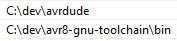

# Arduino Uno - Baremetal

## Toolchain

### Windows

Download the following:

1) Latest release of <code>avrdude</code>:
https://github.com/avrdudes/avrdude

2) The avr-gcc and related tools <code>AVR 8-Bit Toolchain (Windows)</code>:
https://www.microchip.com/en-us/tools-resources/develop/microchip-studio/gcc-compilers

Extract/install above and add the path to environmental variables:

For proper linting:

1) Add to <code>.vscode</code> C/C++ path: <code>"C:/dev/avr8-gnu-toolchain/avr/include"</code>

2) Provide board number as a define, e.g. <code>"\_\_AVR_ATmega328P__"</code>, either in <code>.vscode</code> or as a define in C file.

### Mac

Install packages using homebrew:
1) <code>brew install avrdude</code>
2) <code>brew tap osx-cross/avr</code>
3) <code>brew install avr-gcc avr-binutils</code> 

Linting gives a headache for now...